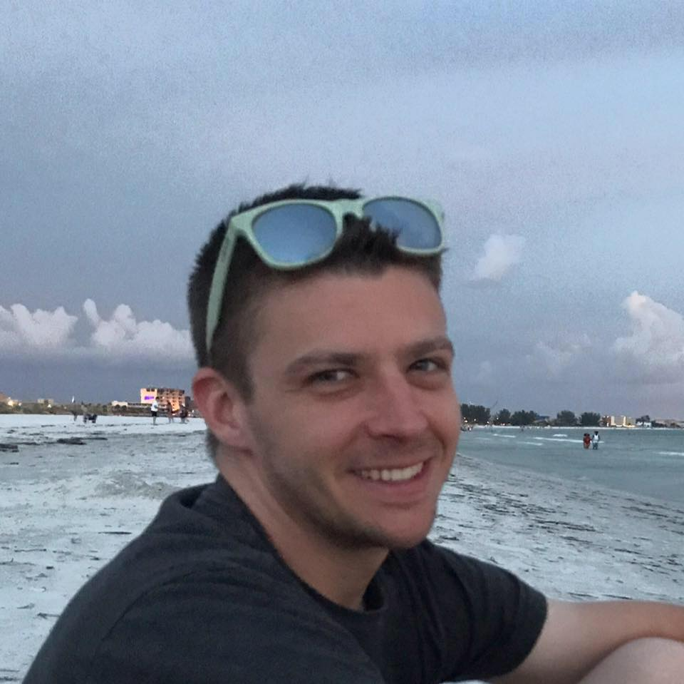

Hey, I'm David Hatcher. This will be my development portfolio, I will be sharing all of my projects and things I learn throughout these projects along with things I learn in my future classes. I am pretty new to coding in general and hoping to learn as much as possible as quickly as I can. I start classes for programming in May 2019 and will hopefully be finished with my Bachelors Degree in 2020-2021. In my free time, when I'm not coding, I enjoy playing video games, watching tv, and playing with my dog.